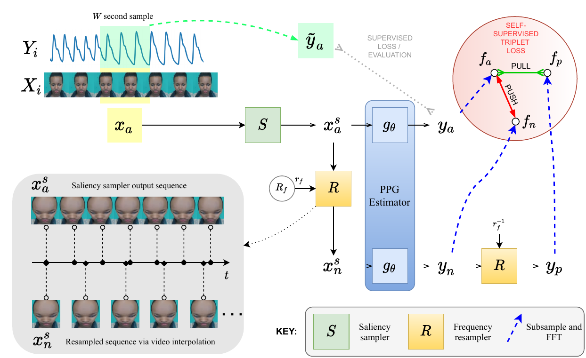

# The Way to my Heart is through Contrastive Learning:<br />Remote Photoplethysmography from Unlabelled Video
The official implementation of <strong><em>The Way to my Heart is through Contrastive Learning: Remote Photoplethysmography from Unlabelled Video</em></strong> that has been accepted to ICCV 2021. The repo was initially adapted from https://github.com/terbed/Deep-rPPG – Deep learning (neural network) based remote photoplethysmography: how to extract pulse signal from video using deep learning tools.



## Conda Environment and Setup
Activate the conda environment:

```
conda env create -f conda_env.yaml
conda activate rppg
```

## Pre-processing Datasets
After downloading each dataset, it is first necessary to preprocess each into a unified format. This step also resamples all physiological sensor data to 30 Hz.

```
./preprocess.py PURE --in_dir /path/to/input_data --out_dir /path/to/output_data --protocols /path/to/hr-cnn/bob/db/pure/data/protocols/
./preprocess.py COHFACE --in_dir /path/to/input_data --out_dir /path/to/output_data
./preprocess.py MR-NIRP-Car --in_dir /path/to/input_data --out_dir /path/to/output_data
./preprocess.py UBFC --in_dir /path/to/input_data --out_dir /path/to/output_data
```

## Viewing Dataset Stats
In order to confirm that datasets are correctly pre-processed, the following commands can be run to display statistics about each dataset. The dataset name, total subjects, total samples, samples per subject, sample duration, minimum duration, and video resolution will be shown.

```
./stats.py --datasets PURE
./stats.py --datasets COHFACE
./stats.py --datasets MR-NIRP-Car
./stats.py --datasets UBFC
```

## Cropping Face Frames
Unless running experiments on the whole video, it is necessary to next crop face frames from all videos. This speeds up the later training process.

```
./extract_features.py --datasets PURE --video_source main
./extract_features.py --datasets COHFACE --video_source main
./extract_features.py --datasets MR-NIRP-Car --video_source main --n_cpu 4
./extract_features.py --datasets UBFC --video_source main
```

## Training and Testing
To train and test contrastive models for the four datasets featured in the ICCV'21 paper (PURE, COHFACE, MR-NIRP-Car, and UBFC), run the following commands:

```
python train.py FrequencyContrast --exp_name train-pure-self-psdmse --datasets PURE --video_source main_crop_s3fd.avi --loss MVTL --epochs 100 --time_depth 300 --batch_size 4 --output_dir checkpoints --exclude_border 15 --use_channels red green blue --contrast_model PhysNet --freq_augm_range 0.666667 1 --test_datasets PURE --val_metric ppg_IPR --test_protocol preset --protocol preset_mix_train_dev --high_pass 40 --test_time_depth 0 --test_time_depth_extractor 300 --crop_height 128 --crop_width 128 --scale_height 64 --scale_width 64 --val_on_train --mvtl_number_views 4 --mvtl_distance PSD_MSE

python train.py FrequencyContrast --exp_name train-cohface-self-psdmse --datasets COHFACE --video_source main_crop_s3fd.avi --loss MVTL --epochs 100 --time_depth 300 --batch_size 4 --output_dir checkpoints --exclude_border 15 --use_channels red green blue --contrast_model PhysNet --freq_augm_range 0.666667 1 --test_datasets COHFACE --val_metric ppg_IPR --test_protocol preset --protocol preset_mix_train_dev --high_pass 40 --test_time_depth 0 --test_time_depth_extractor 300 --crop_height 128 --crop_width 128 --scale_height 64 --scale_width 64 --val_on_train --mvtl_number_views 4 --mvtl_distance PSD_MSE

python train.py FrequencyContrast --exp_name train-mirl-rgb-self-psdmse --datasets MR-NIRP-Car --video_source main_crop_s3fd.avi --loss MVTL --epochs 100 --time_depth 300 --batch_size 4 --output_dir checkpoints --exclude_border 15 --filter_activities sitting --use_channels red green blue --contrast_model PhysNet --freq_augm_range 0.666667 1 --test_filter_activities sitting --test_datasets MR-NIRP-Car --val_metric ppg_IPR --test_protocol round_robin --protocol round_robin_no_dev --high_pass 40 --test_time_depth 300 --test_time_depth_extractor 300 --crop_height 128 --crop_width 128 --scale_height 64 --scale_width 64 --test_chunk_dataset --val_on_train --mvtl_number_views 4 --mvtl_distance PSD_MSE

python train.py FrequencyContrast --exp_name train-ubfc-self-psdmse --datasets UBFC --video_source main_crop_s3fd.avi --loss MVTL --epochs 100 --time_depth 300 --batch_size 4 --output_dir checkpoints --exclude_border 15 --use_channels red green blue --contrast_model PhysNet --freq_augm_range 0.666667 1 --test_datasets UBFC --val_metric ppg_IPR --test_protocol round_robin --protocol round_robin_no_dev --high_pass 40 --test_time_depth 0 --test_time_depth_extractor 300 --crop_height 128 --crop_width 128 --scale_height 64 --scale_width 64 --val_on_train --mvtl_number_views 4 --mvtl_distance PSD_MSE

```

## Running Batch Experiments
To run all experiments shown in Table 3 of the ICCV paper, run the following command:

```
./run_experiments.py --exp_txt exp/iccv.txt
```

## Reference
Please cite:
```
@InProceedings{Gideon_2021_ICCV,
    author    = {Gideon, John and Stent, Simon},
    title     = {The Way to My Heart Is Through Contrastive Learning: Remote Photoplethysmography From Unlabelled Video},
    booktitle = {Proceedings of the IEEE/CVF International Conference on Computer Vision (ICCV)},
    month     = {October},
    year      = {2021},
    pages     = {3995-4004}
}
```

## License
This project is licensed under the MIT License. See [LICENSE](LICENSE) file for further information.
